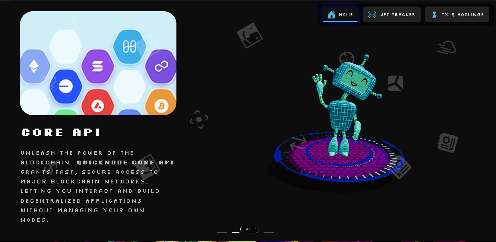
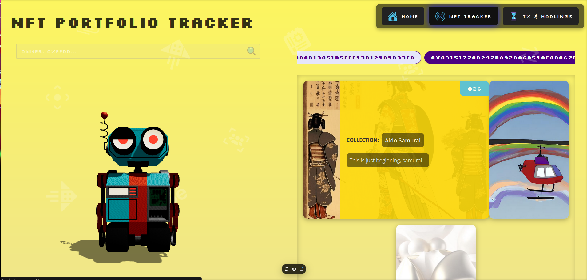
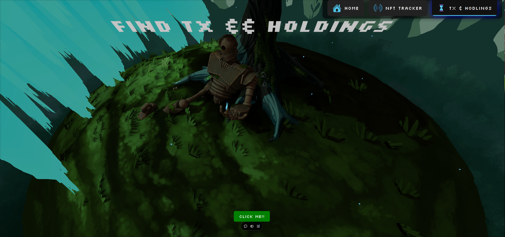
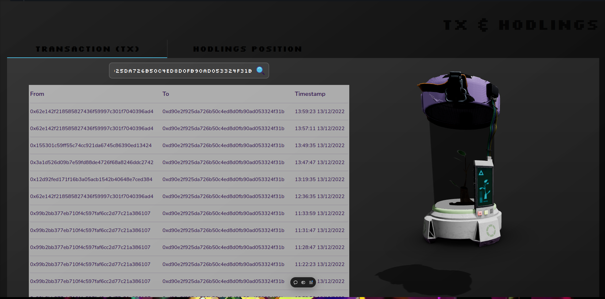
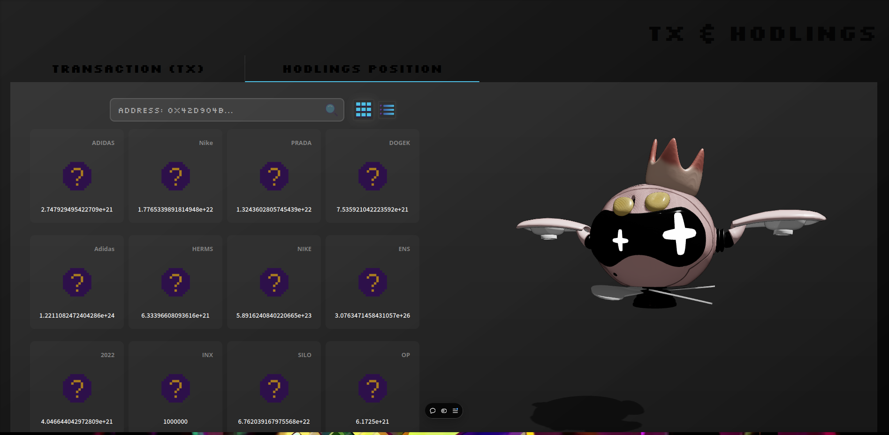

# PloreX
**NFT Explorer and Transaction History App**

**PloreX** This application provides a comprehensive platform for exploring NFT collections and viewing detailed transaction histories. Using the QuickNode API, the app offers users an efficient way to track and manage their NFT assets and blockchain interactions.

## Features

**NFT Explorer**

Collection Insights: Browse detailed information on NFTs, including metadata, images, and associated collection details.
Asset Ownership: View specific assets within a user’s wallet, with relevant details such as token ID, collection name, and blockchain network.
Dynamic Search: Look up assets by wallet address for quick navigation and asset tracking.

**Transaction History**

Real-Time Updates: See up-to-date transaction history for each wallet, including incoming and outgoing transfers.
Comprehensive Details: View information like transaction hashes, timestamps, asset types, and amounts, providing complete transparency into wallet activities.
QuickNode Integration: Fast data retrieval and secure, reliable connections to blockchain data via QuickNode API.

## Challenges we ran into

1. Since the models we used are quite large, we pushed the backend on GitHub and uploaded the models separately on a drive link. We tried to use the aws hosting services but its free tier is only for CPU, not for GPU. Since our project requires GPU, we had to host the backend locally on GitHub. 

2. The team members had to put in a lot of efforts to make the website resposive. There was a long process of acceptance and rejection of page design ideas before unanimously agreeing on the final designs.

## Technologies we used
**Frontend:** React, Tailwind CSS
**Blockchain:** QuickNode API

## Links
[Website](https://pseudo-x.vercel.app)
[Demo Video](https://youtu.be/NCfcEqyrEbA)

## Pictures








## Logo


## Usage

NFT Search: Enter an Ethereum wallet address to explore NFTs associated with that address.

Transaction History: Review transaction history for detailed records of transfers and interactions.

## Set-up Frontend 

To clone this repository to your local machine, follow these steps:

1. Open your terminal or command prompt.
   
2. Run the following command:

   ```bash
   https://github.com/Harsh-BH/PseudoX.git
3. Run the following command:

   ```bash
   npm install 


